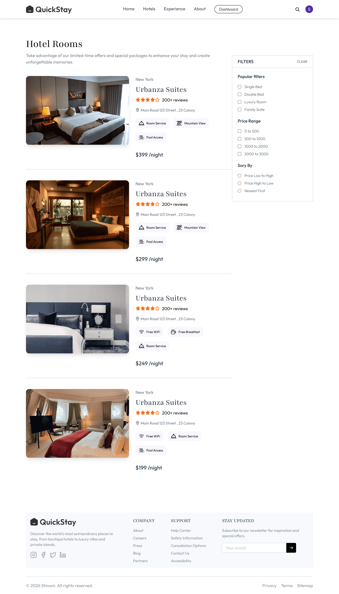
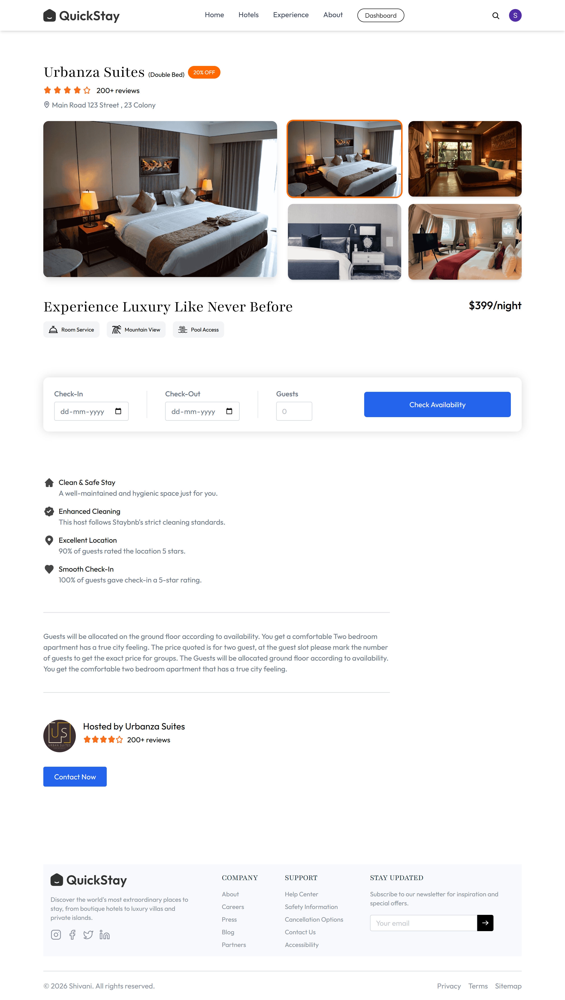
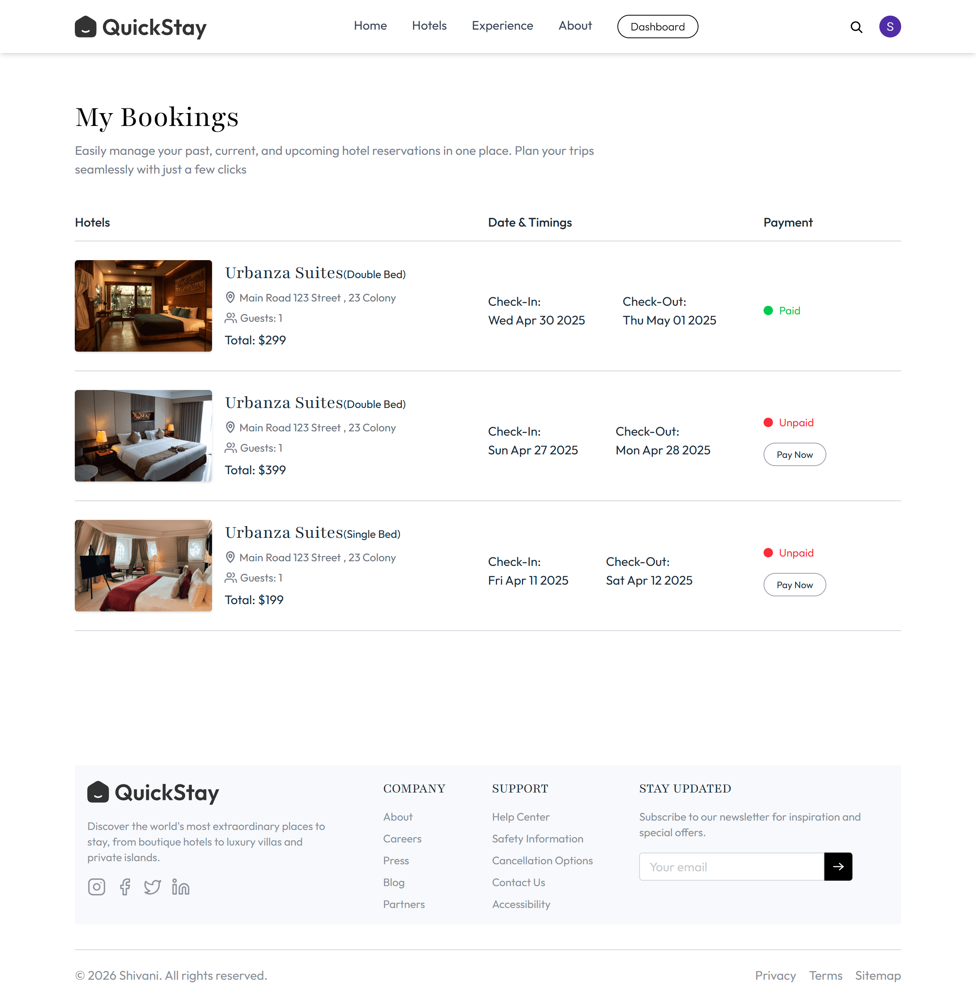
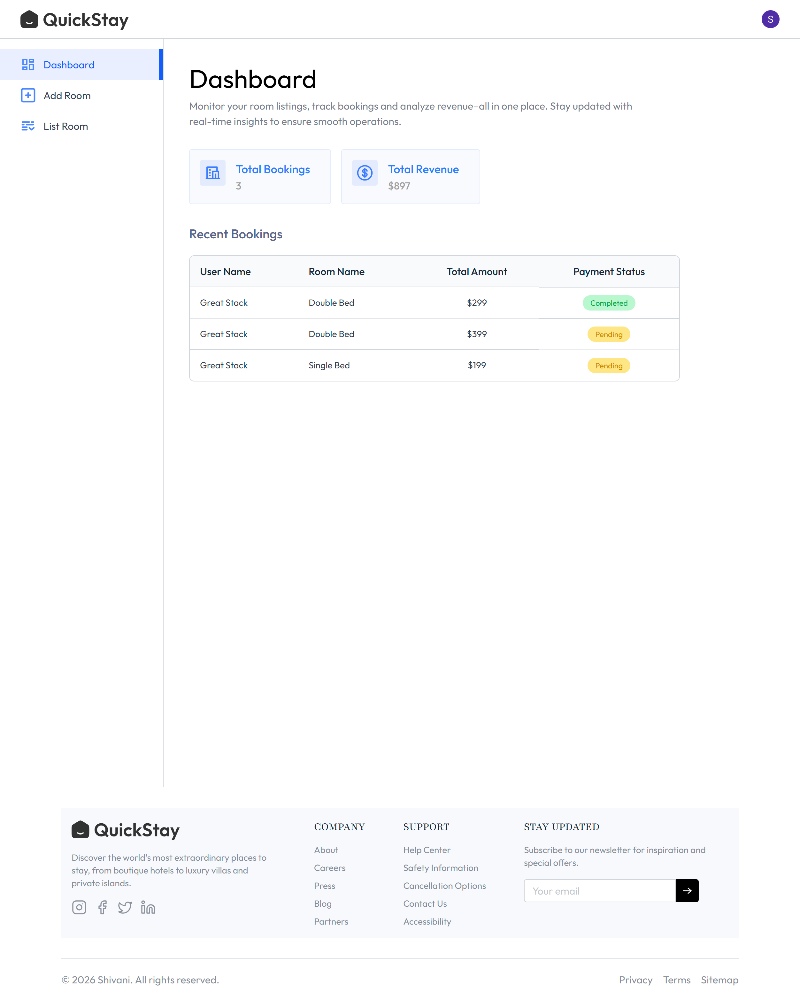
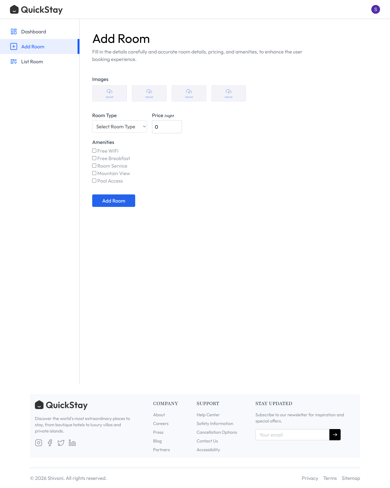
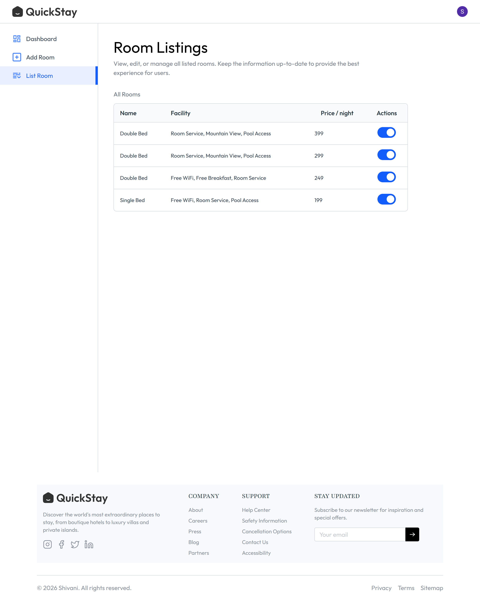

# 🏨 QuickStay - Hotel Booking Web Application

QuickStay is a modern and responsive Hotel Booking Web Application built using **React.js**, **Tailwind CSS**, and **React Router DOM**. It provides a clean and user-friendly interface where users can explore hotels, browse room details, and experience a hotel booking platform. The application also includes a dedicated hotel owner panel for managing hotel rooms.

---

## 📖 About the Project

QuickStay is a frontend hotel booking application developed to practice modern React development concepts. It features a responsive UI, user authentication using Clerk, hotel browsing, room details, booking interface, and a separate dashboard for hotel owners.

---

## ✨ Features

### 👤 User Features

- Responsive Landing Page
- Modern Navigation Bar
- Hero Section
- Featured Hotels Section
- Exclusive Offers Section
- Customer Testimonials
- Newsletter Section (UI)
- Browse Hotel Rooms
- Search & Filter Rooms(UI)
- Room Details Page
- Room Image Gallery
- Hotel Information
- Booking Form Interface
- My Bookings Page
- Clerk Authentication (Login & Signup)

### 🏨 Hotel Owner Features

- Hotel Registration Popup
- Owner Dashboard
- Add New Room
- View Listed Rooms

---

## 🛠 Tech Stack

- React.js
- JavaScript (ES6+)
- Tailwind CSS
- React Router DOM
- Clerk Authentication
- Vite

---

## 📂 Project Structure

```text
QuickStay/
│
├── public/
├── src/
│   ├── assets/
│   ├── components/
│   ├── pages/
│   ├── App.jsx
│   └── main.jsx
│
├── package.json
├── package-lock.json
├── vite.config.js
├── README.md
└── .gitignore
```

## 📱 Responsive Design

The application is fully responsive and works smoothly on:

- 💻 Desktop
- 📱 Mobile
- 📟 Tablet

---

## 🔐 Authentication

This project uses **Clerk Authentication** for:

- User Registration
- User Login
- User Profile Management
- Secure Authentication Flow

---

## 📸 Screenshots

### 🏠 Home Page

<p align="center">
  
</p>

### 🏨 Rooms



### 🛏️ Room Details



### 📅 My Bookings



### 📊 Owner Dashboard



### ➕ Add Room



### 📋 Room Listings



---

## 👩‍💻 Author

**Shivani Tyagi**

GitHub: https://github.com/Shivani1228
